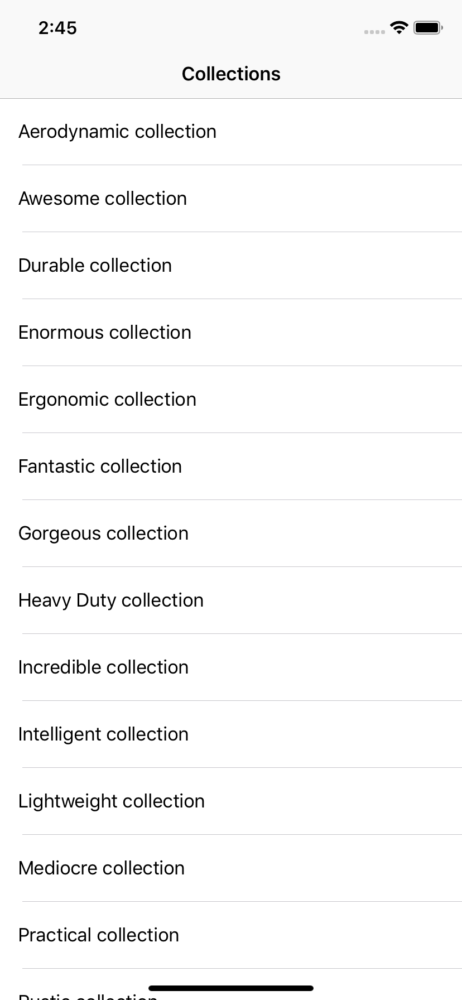
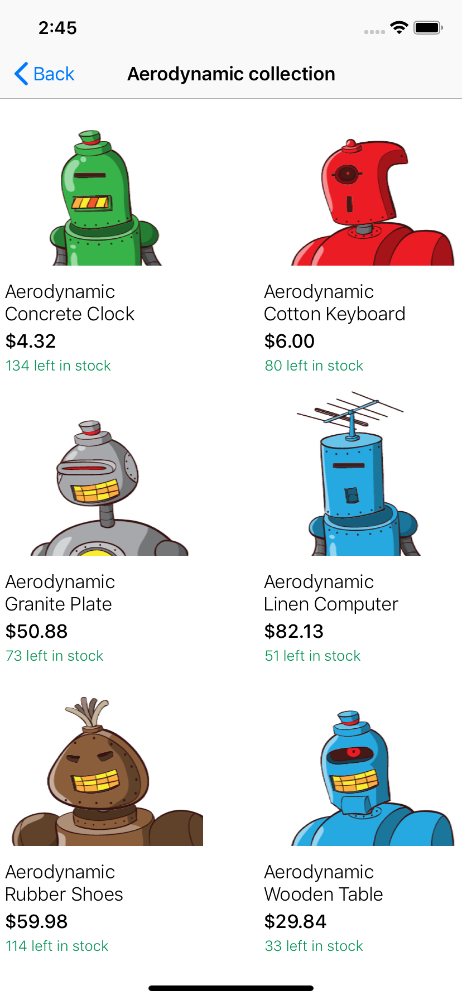

# Shopify iOS Intern Challenge - Summer 2019

**Objective:** This app was created to help manage the different collection of products for my Shopify store. Requirements can be found [here](https://docs.google.com/document/d/1h3TFW9HhFxBVrmgd33dNrUiJx31NQFn6dpZHrbrSP-U/edit#). 

  

## Technical Aspects

My approach to solving this challenge was to recognize individual technical aspects. Firstly, I came up with the architecture (MVC) and designed the different classes that I would need. Afterwards, I used Postman to help make the different API calls to understand how the data is retrieved from the APIs. Once I understood how the data is shared, I modelled the different data I would need to share between controller and display to the users. A ```ShopifyService.swift``` file was created for client requests to Shopify's backend API. 

Breaking down each technical aspect helped in giving me a step by step process to follow when I built the app. I first created a ```UITableView```  to display the custom collection since only the collection name is needed. Once the correct information is displayed in the table view controller, I decided to use the ```UICollectionView``` to display the individual products from a collection. I made this decision so that a product image can be displayed and that there's efficient use of space to display product information. 

### Design

The project was built using MVC architecture. 

**Model:** 
* Collection
  * collectionID
  * collectionName
  
* Product
  * id
  * name
  * price
  * count
  * imageURL
  
**View:**
The view contains the UI components that are visible to the user. This includes the ```UILabel``` and ```UIImageView```. There are two classes, ```CustomCollectionTableViewCell.swift``` (Collection list) and ```DetailCollectionCell.swift``` (Products) that represent the view. 

**Controller:**
The controller is the code that takes the user's action and updates the model and then updates the view. There are two controllers, ```CustomCollectionsTableViewController.swift``` (Collection list) and ```CollectionViewController.swift``` (Product Detail List). 

## Built With

* [Shopify REST API](https://shopicruit.myshopify.com/admin/custom_collections.json?page=1&access_token=c32313df0d0ef512ca64d5b336a0d7c6) - Shopify Custom Collection REST API
* [Alamofire](https://github.com/Alamofire/Alamofire) - HTTP Networking library for Swift
* [SwiftyJSON](https://maven.apache.org/) - JSON parsing library for Swift
* [Kingfisher](https://github.com/onevcat/Kingfisher) - Swift Library used to download/cache images from the web


## Getting Started

These instructions will get you a copy of the project up and running on your local machine for development and testing purposes.

### Prerequisites

After cloning/downloading the project, go into the terminal and ```cd``` to the root of the project. 

Download the cocoapod dependencies
```
pod install
```

## Contributing

Please read [CONTRIBUTING.md](https://gist.github.com/PurpleBooth/b24679402957c63ec426) for details on our code of conduct, and the process for submitting pull requests to us.

## Versioning

We use [SemVer](http://semver.org/) for versioning. For the versions available, see the [tags on this repository](https://github.com/your/project/tags). 

## Authors

* **Raymond Diamonds** - *Initial work* - [PurpleBooth](https://github.com/PurpleBooth)

## License

This project is licensed under the MIT License - see the [LICENSE.md](LICENSE.md) file for details

## Acknowledgments
